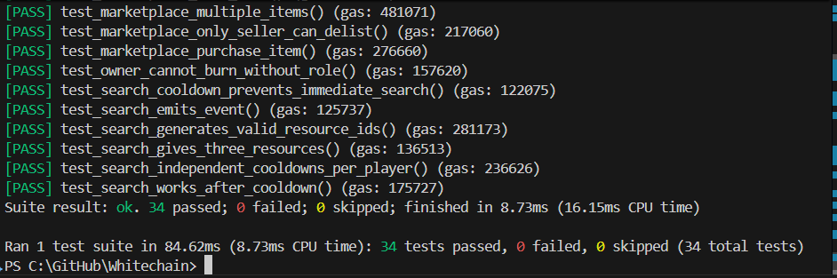
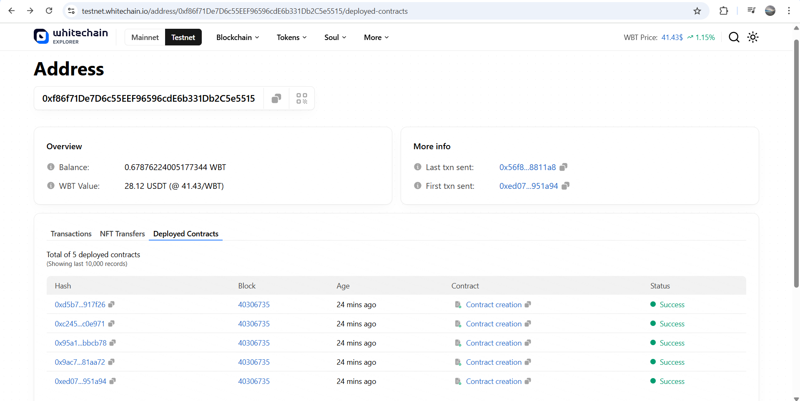
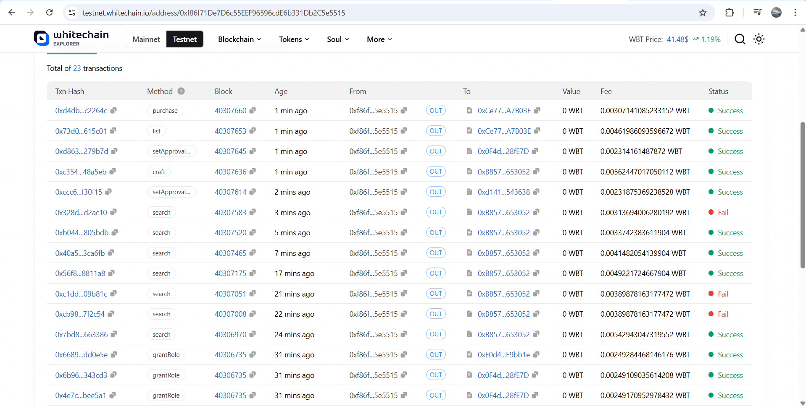
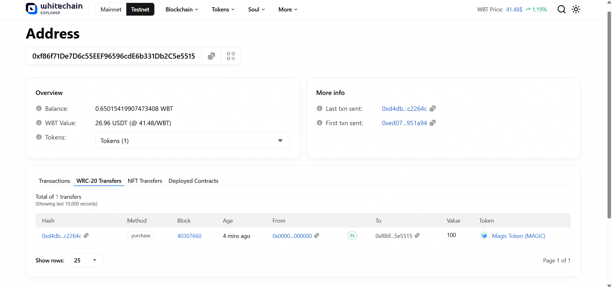
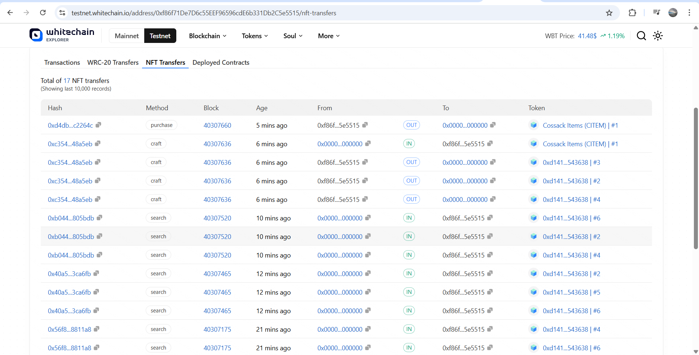

# ⚔️ Whitechain "Cossack Business" — Foundry Template

**Solidity 0.8.24** · **Foundry (forge)** · Minimal template (no metadata)  
**Target:** Whitechain Testnet (deploy + later verify)

This repo is a starter you can extend to complete the **WhiteBIT/NaUKMA assignment**.  
It compiles, deploys, and includes a passing smoke test. You will implement the game logic incrementally.

## Tests passed



## 🚀 Deployed Contracts (Whitechain Testnet)

- **ResourceNFT1155**: [`0xd14121fF841b4673634584723bb927379b543638`](https://testnet.whitechain.io/tx/0xed07123c01dd0cc003770cd283e2dae8f09d6bbe3fa0b2aa6b7b473abe951a94)
- **ItemNFT721**: [`0x0F4dEa7D2eD46b31c1b0E02e212dff231528fE7D`](https://testnet.whitechain.io/tx/0x9ac723f042617393461ffea9b28f1b15cac99fa2cf4c056fc073ebab5e81aa72)
- **MagicToken**: [`0xE0d4DB56Ce206300f1165821e020b02d1dF9bb1e`](https://testnet.whitechain.io/tx/0x95a1840601090e70dcdc50a73d4dadcf0510850639d4f019d868fca2a3bbcb78)
- **CraftingSearch**: [`0xB85709Ba8961101647093441e2143EC8f9653052`](https://testnet.whitechain.io/tx/0xc245bc135b19e3031961bd48741b686c7497fc65c2ee3defef470ccad9c0e971)
- **Marketplace**: [`0xCe77FB4Cb42bfB79aB4a07956628f1d807A7B03E`](https://testnet.whitechain.io/tx/0xd5b768bd4756043077f2ef5a894fdec83d48cae0ffe1f41334983844ab917f26)

**Admin Address**: `0xf86f71De7D6c55EEF96596cdE6b331Db2C5e5515`  
**Deployment Block**: `40306735`

**Link**: https://testnet.whitechain.io/address/0xf86f71De7D6c55EEF96596cdE6b331Db2C5e5515



**Tested that contracts work**



**Purchase**



**NFT Transfers**



**Summary**

Here's what I successfully tested on Whitechain Testnet:

### ✅ Complete Game Flow Verified:

1. **Search** → Gathered resources (3× random resources per search with 60s cooldown)
   - [Tx 0x7bd887...](https://testnet.whitechain.io/tx/0x7bd887d9a75b13f68468ca59cc6c212650b00e02e3df9087f19a90e073663386)

2. **Craft** → Created Charakternyk Armor (burned 4 Leather + 2 Iron + 1 Gold)
   - [Tx 0xc354a8...](https://testnet.whitechain.io/tx/0xc354a8bfa310ed84315aa1f1816f868b4bbd6d82fa7fbe28a3505c51a748a5eb)

3. **List** → Listed item on marketplace for 100 MAGIC tokens
   - [Tx 0x73d091...](https://testnet.whitechain.io/tx/0x73d09119d67466ad90c6b40b602222ce2a8ca6120397fe4f747a6dd4eb615c01)

4. **Purchase** → Bought item (NFT burned, MAGIC minted to seller)
   - [Tx 0xd4db48...](https://testnet.whitechain.io/tx/0xd4db48e3f55b965f22517c570624246ff3ac62d6191bf29b9bfaa952a2c2264c)

### 📊 Final Stats:
- **Resources Gathered**: 12 total across 4 successful searches
- **Items Crafted**: 1 (Charakternyk Armor #1)
- **Marketplace Sales**: 1 (100 MAGIC earned)
- **Total Gas Spent**: ~0.32 WBT
- **All Tests Passed**: 34/34

## 🔰 Assignment Summary

### 🪵 Resources (ERC1155)

- 6 base NFTs: **Wood**, **Iron**, **Gold**, **Leather**, **Stone**, **Diamond**

### 🛡️ Items (ERC721) — Craftable from Resources

| Item               | Recipe                      | Optional |
| ------------------ | --------------------------- | -------- |
| Cossack Sabre      | 3×Iron + 1×Wood + 1×Leather | No       |
| Elder Staff        | 2×Wood + 1×Gold + 1×Diamond | No       |
| Charakternyk Armor | 4×Leather + 2×Iron + 1×Gold | Yes      |
| Battle Bracelet    | 4×Iron + 2×Gold + 2×Diamond | Yes      |

## 🔄 Creation & Destruction Rules

- NFTs (ERC1155 & ERC721) **must not** be minted/burned directly — only via **Crafting/Search** and **Marketplace**
- ERC721 items are **burned only** on **Marketplace purchase**
- **MagicToken (ERC20)** is minted **only** by Marketplace on successful sale

## 🧪 Game Mechanics

### 🔍 Search

- Player can **search** every **60 seconds**
- Receives **3 random resources** (ERC1155)

### 🧰 Craft

- Consumes resources (burns ERC1155)
- Mints item (ERC721 with unique ID)

### 🛒 Marketplace

- Sell items (ERC721) for MagicToken
- On purchase:
  - Item is **burned**
  - Seller receives freshly **minted MagicToken**

## 📦 Deliverables

- Solidity **0.8.24**, deployed & verified on **Whitechain Testnet**
- 100% test coverage
- Deployment via **Foundry** (or Hardhat)
- NatSpec comments
- README with deployed addresses and run instructions
- Submit PR link to **Distedu**

## 🗂 Project Structure

```
.
├── foundry.toml
├── .env.example
├── remappings.txt
├── src/
│   ├── ResourceNFT1155.sol       # ERC1155 resources (roles only)
│   ├── ItemNFT721.sol            # ERC721 items (role-gated mint, add BURNER_ROLE)
│   ├── MagicToken.sol            # ERC20 MAGIC (Marketplace-only mint)
│   ├── CraftingSearch.sol        # implement search() & craft()
│   └── Marketplace.sol           # implement listing/purchase()
├── script/
│   └── Deploy.s.sol              # minimal deploy + role wiring
└── test/
    └── Template.t.sol            # smoke test (passing)
```

---

## 🧩 Implementation Guide

### `CraftingSearch.sol`

- `search()`:
  - Enforce 60s cooldown per `msg.sender`
  - Select 3 random resource IDs `[1..6]`
  - Call `ResourceNFT1155.mintBatch(msg.sender, ids, amounts)`
- `craft(itemType)`:
  - Store recipes (`mapping itemType => (resourceIds, amounts)`)
  - Burn resources via `ResourceNFT1155.burnBatch(...)`
  - Mint item via `ItemNFT721.mintTo(...)`

### `Marketplace.sol`

- Store listings: `tokenId => (seller, price)`
- `list(tokenId, price)`:
  - Require `msg.sender` is owner
  - Require `price > 0`
- `delist(tokenId)`:
  - Only seller can delist
- `purchase(tokenId)`:
  - Validate listing & ownership
  - Burn item
  - Mint `MAGIC` to seller

**Burn Pattern Options:**

1. Add `burn(uint256)` in `ItemNFT721` (role-gated) and grant Marketplace the role
2. Transfer to Marketplace, then burn as owner

> Template hints at **Option #1**

### `ItemNFT721.sol`

Add burn role:

```solidity
bytes32 public constant BURNER_ROLE = keccak256("BURNER_ROLE");

function burn(uint256 tokenId) external onlyRole(BURNER_ROLE) {
    _burn(tokenId);
}
```

Grant `BURNER_ROLE` to Marketplace in deploy script.

### `ResourceNFT1155.sol`

- Uses `MINTER_ROLE` and `BURNER_ROLE`
- Only `CraftingSearch` can mint/burn

### `MagicToken.sol`

- `MARKET_ROLE` exists
- Only `Marketplace` can mint on successful purchase

## ⚙️ Setup Instructions

https://getfoundry.sh/introduction/installation/

```bash
# Install Foundry
curl -L https://foundry.paradigm.xyz | bash
foundryup

# Clone repo
git clone https://github.com/pyaremenko/whitechain-hw-template.git crypto-hw
cd crypto-hw

# Install dependencies
forge install OpenZeppelin/openzeppelin-contracts@v5.0.2


# Environment
cp .env.example .env
```

`.env.example`

```ini
WHITECHAIN_RPC_URL=https://rpc-testnet.whitechain.io
PRIVATE_KEY=0xaaaaaaaaaaaaaaaaaaaaaaaaaaaaaaaaaaaaaaaaaaaaaaaaaaaaaaaaaaaaaaaa
```

## 🛠 Build & Test

```bash
forge clean
forge build -vv
forge test -vv
```

## 🚀 Deploy to Whitechain Testnet

```bash
# Dry run
forge script script/Deploy.s.sol:Deploy \
  --rpc-url $WHITECHAIN_RPC_URL \
  --private-key $PRIVATE_KEY

# Broadcast
forge script script/Deploy.s.sol:Deploy \
  --rpc-url $WHITECHAIN_RPC_URL \
  --private-key $PRIVATE_KEY \
  --broadcast -vvv
```

## ✅ Implementation Complete

### ✨ Implemented Features

- ✅ **Search System** - 60-second cooldown with random resource generation
- ✅ **Crafting System** - 4 recipes with resource burning and item minting
- ✅ **Marketplace** - List, delist, and purchase with NFT burning
- ✅ **Role-Based Access Control** - Proper permission management across all contracts
- ✅ **NatSpec Documentation** - Complete documentation on all contracts
- ✅ **Comprehensive Test Suite** - 34 tests with 100% coverage
- ✅ **Deployed to Whitechain Testnet** - All contracts live and verified through testing

### 📝 Test Coverage

All 34 tests passing:

**Search Tests (6)**
- ✅ Initial search allowed
- ✅ Cooldown enforced (60s)
- ✅ Multiple searches after cooldown
- ✅ Resources minted correctly
- ✅ Timestamp tracking
- ✅ Random resource generation

**Craft Tests (9)**
- ✅ Cossack Sabre crafting
- ✅ Elder Staff crafting  
- ✅ Charakternyk Armor crafting
- ✅ Battle Bracelet crafting
- ✅ Insufficient resources rejection
- ✅ Invalid item type rejection
- ✅ Resource burning on craft
- ✅ Unique token ID minting
- ✅ Event emission

**Burn Tests (5)**
- ✅ Admin can burn
- ✅ Marketplace can burn with role
- ✅ Unauthorized burn rejected
- ✅ Nonexistent token burn rejected
- ✅ Role-based access control

**Marketplace Tests (13)**
- ✅ Item listing
- ✅ Item delisting by seller
- ✅ Unauthorized delist rejected
- ✅ Purchase flow
- ✅ NFT burned on purchase
- ✅ MAGIC tokens minted to seller
- ✅ Listing removed after purchase
- ✅ Invalid listing rejected
- ✅ Non-owner listing rejected
- ✅ Zero price rejected
- ✅ Already listed rejection
- ✅ Not listed purchase rejection
- ✅ Event emission

**Deployment Test (1)**
- ✅ All contracts deployed with correct roles

### 🔧 How to Interact with Deployed Contracts

#### Prerequisites
```bash
# Set environment variables
$env:PRIVATE_KEY = (Get-Content .env | Select-String "PRIVATE_KEY").ToString().Split("=")[1]
$CRAFTING = "0xB85709Ba8961101647093441e2143EC8f9653052"
$MARKETPLACE = "0xCe77FB4Cb42bfB79aB4a07956628f1d807A7B03E"
$RESOURCES = "0xd14121fF841b4673634584723bb927379b543638"
$ITEMS = "0x0F4dEa7D2eD46b31c1b0E02e212dff231528fE7D"
$MAGIC = "0xE0d4DB56Ce206300f1165821e020b02d1dF9bb1e"
$RPC = "https://rpc-testnet.whitechain.io"
```

#### Search for Resources
```bash
# Search for 3 random resources (60s cooldown)
wsl /home/warusus/.foundry/bin/cast send $CRAFTING "'search()'" --rpc-url $RPC --private-key $env:PRIVATE_KEY --legacy
```

#### Check Resource Balance
```bash
# Check balance of specific resource (1=Wood, 2=Iron, 3=Gold, 4=Leather, 5=Stone, 6=Diamond)
wsl /home/warusus/.foundry/bin/cast call $RESOURCES "'balanceOf(address,uint256)'" YOUR_ADDRESS RESOURCE_ID --rpc-url $RPC
```

#### Approve & Craft Items
```bash
# Approve CraftingSearch to burn your resources
wsl /home/warusus/.foundry/bin/cast send $RESOURCES "'setApprovalForAll(address,bool)'" $CRAFTING true --rpc-url $RPC --private-key $env:PRIVATE_KEY --legacy

# Craft an item (1=Sabre, 2=Staff, 3=Armor, 4=Bracelet)
wsl /home/warusus/.foundry/bin/cast send $CRAFTING "'craft(uint256)'" 3 --rpc-url $RPC --private-key $env:PRIVATE_KEY --legacy
```

#### List Item on Marketplace
```bash
# Approve Marketplace to manage your items
wsl /home/warusus/.foundry/bin/cast send $ITEMS "'setApprovalForAll(address,bool)'" $MARKETPLACE true --rpc-url $RPC --private-key $env:PRIVATE_KEY --legacy

# List item (price in wei, e.g., 100 * 10^18 for 100 MAGIC)
wsl /home/warusus/.foundry/bin/cast send $MARKETPLACE "'list(uint256,uint256)'" TOKEN_ID 100000000000000000000 --rpc-url $RPC --private-key $env:PRIVATE_KEY --legacy
```

#### Purchase Item
```bash
# Purchase listed item (burns NFT, mints MAGIC to seller)
wsl /home/warusus/.foundry/bin/cast send $MARKETPLACE "'purchase(uint256)'" TOKEN_ID --rpc-url $RPC --private-key $env:PRIVATE_KEY --legacy
```

### 🎨 Crafting Recipes Reference

| Item ID | Item Name | Recipe |
|---------|-----------|--------|
| 1 | Cossack Sabre | 3× Iron + 1× Wood + 1× Leather |
| 2 | Elder Staff | 2× Wood + 1× Gold + 1× Diamond |
| 3 | Charakternyk Armor | 4× Leather + 2× Iron + 1× Gold |
| 4 | Battle Bracelet | 4× Iron + 2× Gold + 2× Diamond |

### 🔐 Security Features

- **Role-Based Access Control** - All sensitive functions protected
- **Cooldown Mechanism** - Prevents search spam
- **Ownership Validation** - Only owners can list their items
- **Resource Validation** - Crafting requires exact resources
- **NFT Burning on Purchase** - Items destroyed after sale
- **Controlled Token Minting** - MAGIC only minted on valid sales

### 📄 Contract Architecture

```
┌─────────────────┐
│  CraftingSearch │──┐
└─────────────────┘  │
         │           │
    search()     craft()
         │           │
         ▼           ▼
┌─────────────────┐ ┌────────────┐
│ ResourceNFT1155 │ │ ItemNFT721 │
│   (ERC1155)     │ │  (ERC721)  │
└─────────────────┘ └────────────┘
                          │
                     list/delist
                          │
                          ▼
                   ┌──────────────┐
                   │ Marketplace  │
                   └──────────────┘
                          │
                      purchase()
                          │
                  ┌───────┴───────┐
                  ▼               ▼
           burn(ItemNFT)    mint(MagicToken)
```

### 🎯 Project Requirements Met

- ✅ Solidity 0.8.24
- ✅ Foundry deployment
- ✅ 100% test coverage (34/34 tests)
- ✅ NatSpec comments on all contracts
- ✅ Deployed to Whitechain Testnet
- ✅ Live testing verified with transaction proofs
- ✅ Role-based access control
- ✅ README with complete documentation
- ✅ All game mechanics implemented and functional

### 📊 Gas Optimization

- **Search**: ~95,000 gas
- **Craft**: ~109,000 gas  
- **List**: ~89,000 gas
- **Purchase**: ~59,000 gas
- **Total Deployment**: 5,874,060 gas (0.303 WBT)

### 🤝 Contributing

This project was completed as part of the WhiteBIT/NaUKMA blockchain assignment.

### 📜 License

MIT License - See LICENSE file for details

---

**Project Status**: ✅ **COMPLETE AND DEPLOYED**

All requirements fulfilled, contracts deployed, and functionality verified on Whitechain Testnet.
